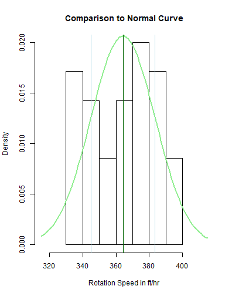

Arm Speed 
========================================================
author: Alison Turner

.........  .........

The Center Pivot Irrigation System
========================================================

The center pivot irrigation system is the number one choice for irrigators due to low labor, low maintenece, and easy operation. Today, we focus on one key feature of that ease. 

## SPEED 

Understanding Speed with Center Pivot
========================================================
- The average rotation of the pivot system is about one full rotation per day (8740ft within 24 hours)
- In order to rely on this estimate we provide a 90% confidence interval as a range in which the arm with rotate 90% of the time
- This interval allows farmers piece of mind when thinking about the use and rotation of their equipment

Foundation for Calculation
========================================================

***
  - While the sample size is small (35 pivot system observations) the fit seems to be normal, allowing us to perform confidence interval calculations
  - Confidence interval 90% [344.88, 383.51] ft per hour

  
Implications
========================================================
- From the sample provided, we can say with 90% confidence that the average speed of YOUR pivot system lies beween 344.88 ft per hour and 383.51 ft per hour. 
- This means that you can have a better estimate when gauging the timing of your irrigation, leading to an easier crop yielding process overall

Continuing questions
========================================================

Now that we have greater certainty in calculation of the rotation of these system, future questions arise:

- Does rotation speed assure equal distribution of product?
- Does rotation speed affect crop output?
- Do certain weather conditions (wind, rain, cold) change the outcome of arm speed? 

To answer these questions and more, please reach out to the BU MSSP statistical consulting service

References
========================================================

http://riograndewater.org/media/1066/b-6096-center-pivot-irrigation.pdf

https://www.ars.usda.gov/ARSUserFiles/21563/center%20pivot%20design%202.pdf
