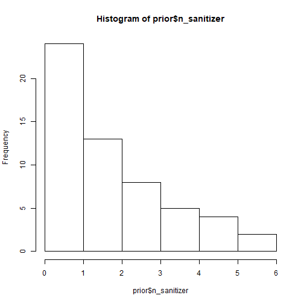
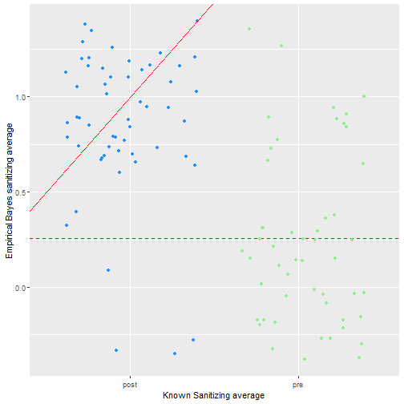

HandSanitizer
========================================================
author: Alison Turner
date: March 6, 2020
autosize: true


The Background
========================================================

After installing hand sanitizer dispensers, a hospital undertakes an educational program for 23 nurses on the importance of using hand sanitizer before entering patient rooms.The nurses' use of hand sanitizer is observed before and after the training.  

Before the educational program nurses were observed visiting 51 patient rooms, and they used sanitizer only 13 times. Assume that $p$ is the probability that a nurse uses handsanitizer two months after the training. The success of the program will be evaluated by comparing $p$ with 13/51, which is the proportion of visits where hand sanitizer was used before the educational program.


The Directive
========================================================
Calculate the posterior $pdf$ for $p$ using two prior distributions for $p$:

- $p∼U(0,1)$, which might be more conveniently expressed as a beta distribution.
- $p∼Beta(13,38)$, which has mean = 13/51.

The Directive: Part 1
========================================================




```
[1] 0
```

***

$p∼U(0,1)$ - the beta distribution

The Directive: Part 2
========================================================



***
$p∼Beta(13,38)$, which has mean = 13/51.

$$ \alpha = .9803 $$
$$ \beta = 2.866 $$

$$ (13+\alpha)/(51+\alpha+\beta) $$
= 25.5% handsanitizer use rate


Comparison to the result
========================================================

Two months after the training, the nurses were observed visiting 56 patient rooms, and they used sanitizer in 50 of the 56 visits.

When calculating this situation with the posterior distribution you get the result:
$$ (51+\alpha)/(56+\alpha+\beta) = 85.2% $$
which is slightly worse than the actual of 89.2%


Acknowledgements
========================================================
This being my first go round with Bayes, priors, and posteriors I was thankful for the resources provided by David Robinson, who has a spectacular blog and github repo that go through the use of the Beta distribution and help to put it's use into practical terms. Additionally, Larry Wasserman's lecture on Bayes, and Kathryn Haglich's passion for Bayesian methods were great for context. 


http://varianceexplained.org/statistics/beta_distribution_and_baseball/

http://www.stat.cmu.edu/~larry/=sml/Bayes.pdf

https://rpubs.com/klinares/443186


Questions
========================================================
- In a study where there wasn't such a stark change in sanitizer use, how would the use of priors change? 
- If this study were to be done in other hospitals, how could we use this information to inform there? Can new pieces of information be brought in to the prior on each iteration?

(food for thought over spring break!)
